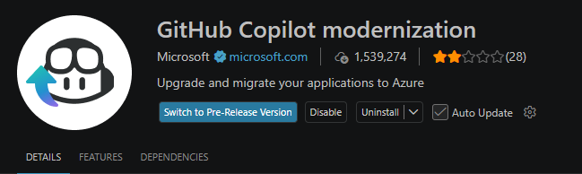
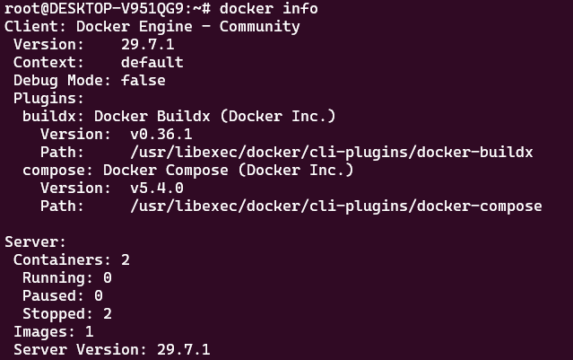
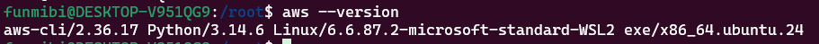

# DevOps Workstation Setup

## Step 1: Prepare the Host Environment

### Objective

The objective of this step is to verify that the host machine satisfies the minimum hardware and software requirements for a DevOps workstation. This includes checking the operating system, available memory, processor, storage, and ensuring the system is updated before installing development tools.

---

## Host Environment

| Component | Details |
|-----------|---------|
| Host Operating System | Windows 11 |
| Linux Environment | Ubuntu 24.04 LTS (WSL2) |
| RAM | 4 GB | 24 GB | 
| Storage | 10 GB | 954 GB Available | 
| Terminal | Windows Terminal |
---

The workstation provides:

- Windows 11 as the host operating system.
- Ubuntu 24.04 LTS running on WSL2.
- 24 GB of installed RAM.
- An Intel Core i5-1135G7 processor with Intel VT-x virtualization support.
- Approximately 954 GB of available storage within the Ubuntu environment.
- A fully compatible environment for installing Git, Visual Studio Code, Docker, Kubernetes (Minikube), Terraform, Ansible, and other DevOps tools.


# Step 2: Establish Version Control

## Objective

Install and configure Git as the version control system for the development environment. Git enables source code management, collaboration, version tracking, and integration with remote repositories such as GitHub and GitLab. Additionally, Visual Studio Code.

---

## Install Git

The package repositories were updated before installing Git.

### Commands

```bash
sudo apt update
sudo apt install git -y
```

---

## Verify Git Installation

After installation, the Git version was verified.

### Command

```bash
git --version
```

```text
git version 2.43.0
```


## Configure Git

```bash
git config --global user.name "Your Name"

git config --global user.email "your-email@example.com"
```

---

## Verify Git Configuration


### Command

```bash
git config --list
```

## Generate an SSH Key

To enable secure authentication with GitHub or GitLab, an SSH key pair was generated.

### Command

```bash
ssh-keygen -t ed25519 -C "funmibiadedokun81@gmail.com"
```


## Display the Public Key

The public key was displayed so it could be copied into a GitHub or GitLab account.

```bash
cat ~/.ssh/id_ed25519.pub
```

Copy the displayed key and add it to your Git hosting platform.

---

## Test the GitHub Connection

After adding the SSH key to GitHub, the connection was tested.

```bash
ssh -T git@github.com
```


---

# Install Visual Studio Code

Visual Studio Code was installed as the primary integrated development environment (IDE).

### Install Snap 

```bash
sudo apt install snapd -y
```

### Install Visual Studio Code

- download and install from microsoft's official download page

## Verify Installation

```bash
code --version
```

## Launch Visual Studio Code

```bash
code .
```
The command opens the current working directory inside Visual Studio Code.

---

# Install the WSL Extension

Within Visual Studio Code, the **WSL** extension was installed to enable seamless development inside the Ubuntu WSL2 environment.

Steps:
1. Open Visual Studio Code.
2. Select the **Extensions** icon.
3. Search for **WSL**.
4. Install the extension published by Microsoft.


# Step 3: Integrate AI Capabilities

## Objective

The objective of this step is to integrate AI-assisted development tools into the DevOps workstation. 

---

# Install GitHub Copilot

GitHub Copilot was installed from the Visual Studio Code Marketplace.

## Installation Steps

1. Launch Visual Studio Code.
2. Open the **Extensions** panel.
3. Search for:

```
GitHub Copilot
```
4. Select the extension published by **GitHub**.
5. Click **Install**.
6. Sign in using your GitHub account when prompted.
7. Authorize Visual Studio Code to access GitHub Copilot.




# Step 4: Install Containerization Tools

## Objective

The objective of this step is to install and configure Docker and Docker Compose to provide a containerized development environment. 

---

# Install Docker

Docker Engine and Docker CLI were installed using Docker's official installation script.

## Update Package Repository

```bash
sudo apt update
sudo apt upgrade -y
```

## Install Required Dependencies

```bash
sudo apt install -y ca-certificates curl gnupg lsb-release
```

## Install Docker

```bash
# Add Docker's official GPG key:
sudo apt update
sudo apt install ca-certificates curl
sudo install -m 0755 -d /etc/apt/keyrings
sudo curl -fsSL https://download.docker.com/linux/ubuntu/gpg -o /etc/apt/keyrings/docker.asc
sudo chmod a+r /etc/apt/keyrings/docker.asc

# Add the repository to Apt sources:
sudo tee /etc/apt/sources.list.d/docker.sources <<EOF
Types: deb
URIs: https://download.docker.com/linux/ubuntu
Suites: $(. /etc/os-release && echo "${UBUNTU_CODENAME:-$VERSION_CODENAME}")
Components: stable
Architectures: $(dpkg --print-architecture)
Signed-By: /etc/apt/keyrings/docker.asc
EOF

sudo apt update
```
---

# Configure Docker

To allow the current user to run Docker commands without using `sudo`, the user was added to the Docker group.

## Command

```bash
sudo usermod -aG docker $USER
```

Apply the group changes.

```bash
newgrp docker
```

---
# Verify Docker Installation

Verify that Docker was successfully installed.

## Command

```bash
docker --version
```

```text
Docker version 29.7.1, build e9452d6
```
---

# Verify Docker Compose

Docker Compose is included with modern Docker installations as a Docker CLI plugin.

## Command

```bash
docker compose version
```

```text
Docker Compose version v5.4.0
```
---

# Test Docker
Run the official Docker Hello World container.

## Command

```bash
docker run hello-world
```

```text
Hello from Docker!
This message shows that your installation appears to be working correctly.
```
---

# Verify Docker Service

```bash
docker info
```

This command displays information about the Docker Engine, including storage driver, container runtime, images, and system resources.

---



# Step 6: Configure Cloud and Language Runtimes

## Objective

The objective of this step is to install and configure the essential cloud command-line interfaces (CLIs) and development runtimes required for modern DevOps workflows.

---
# Update the System

## Command

```bash
sudo apt update
sudo apt upgrade -y
```

---

# Install AWS CLI
The AWS Command Line Interface (AWS CLI) provides a unified interface for managing AWS services directly from the terminal.

## Download AWS CLI

```bash
curl "https://awscli.amazonaws.com/awscli-exe-linux-x86_64.zip" -o "awscliv2.zip"
```

## Install unzip

```bash
sudo apt install unzip -y
```

## Extract the Installer

```bash
unzip awscliv2.zip
```

## Install AWS CLI

```bash
sudo ./aws/install
```

---

# Verify AWS CLI Installation

## Command

```bash
aws --version
```

```text
aws-cli/2.36.17 Python/3.14.6 Linux/6.6.87.2-microsoft-standard-WSL2 exe/x86_64.ubuntu.24.
```
---

# Configure AWS CLI

If an AWS account is available, configure the CLI.

```bash
aws configure
```

The following information was requested:

- AWS Access Key ID
- AWS Secret Access Key
- Default Region
- Default Output Format
---


# Install Azure CLI

The Azure CLI enables management of Microsoft Azure resources directly from the command line.

## Install Dependencies

```bash
sudo apt install ca-certificates curl apt-transport-https lsb-release gnupg -y
```

## Import Microsoft's Signing Key

```bash
curl -sL https://packages.microsoft.com/keys/microsoft.asc | \
gpg --dearmor | \
sudo tee /etc/apt/trusted.gpg.d/microsoft.gpg > /dev/null
```

## Add the Azure CLI Repository

```bash
AZ_REPO=$(lsb_release -cs)

echo "deb [arch=$(dpkg --print-architecture)] https://packages.microsoft.com/repos/azure-cli/ $AZ_REPO main" | \
sudo tee /etc/apt/sources.list.d/azure-cli.list
```

## Install Azure CLI

```bash
sudo apt update
sudo apt install azure-cli -y
```

---

# Verify Azure CLI

```bash
az version
```

```text
{
  "azure-cli": "2.89.0",
  "azure-cli-core": "2.89.0",
  "azure-cli-telemetry": "1.1.0",
  "extensions": {}
}
```

---

# Login to Azure

```bash
az login
```

---

# Install Node.js

## Download and Install NVM (Node Version Manager)

Run the following command to install **NVM**:

```bash
curl -o- https://raw.githubusercontent.com/nvm-sh/nvm/v0.40.6/install.sh | bash
```
---

## Load NVM Without Restarting the Terminal

Instead of closing and reopening your terminal, load NVM into your current shell:

```bash
\. "$HOME/.nvm/nvm.sh" or source ~/.bashrc
```

---

## 3. Install Node.js

Install the latest Node.js v24 release:

```bash
nvm install 24
```

---

## 4. Verify the Installation

### Check the Node.js version

```bash
node -v
```

```text
v24.19.0
```

### Check the npm version

```bash
npm -v
```

```text
11.17.0
```

---

# Install jq

The `jq` utility is a lightweight command-line JSON processor frequently used in shell scripts, CI/CD pipelines, and cloud automation.

## Install jq

```bash
sudo apt install jq -y
```
---

# Verify jq

```bash
jq --version
```

```text
jq-1.7
```
---
