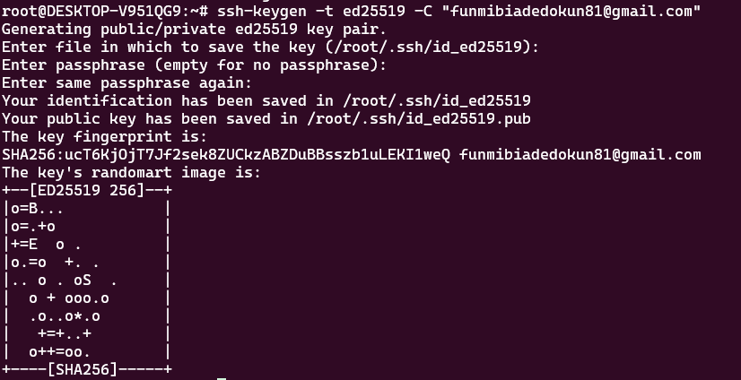
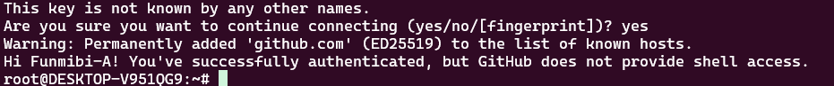

# DevOps Workstation Setup

## Step 1: Prepare the Host Environment

### Objective

The objective of this step is to verify that the host machine satisfies the minimum hardware and software requirements for a DevOps workstation. This includes checking the operating system, available memory, processor, storage, and ensuring the system is updated before installing development tools.

---

## Host Environment

| Component | Details |
|-----------|---------|
| Host Operating System | Windows 11 |
| Linux Environment | Ubuntu 24.04 LTS (WSL2) |
| RAM | 4 GB | 24 GB | 
| Storage | 10 GB | 954 GB Available | 
| Terminal | Windows Terminal |
---

The workstation provides:

- Windows 11 as the host operating system.
- Ubuntu 24.04 LTS running on WSL2.
- 24 GB of installed RAM.
- An Intel Core i5-1135G7 processor with Intel VT-x virtualization support.
- Approximately 954 GB of available storage within the Ubuntu environment.
- A fully compatible environment for installing Git, Visual Studio Code, Docker, Kubernetes (Minikube), Terraform, Ansible, and other DevOps tools.


# Step 2: Establish Version Control

## Objective

Install and configure Git as the version control system for the development environment. Git enables source code management, collaboration, version tracking, and integration with remote repositories such as GitHub and GitLab. Additionally, Visual Studio Code.

---

## Install Git

The package repositories were updated before installing Git.

### Commands

```bash
sudo apt update
sudo apt install git -y
```

---

## Verify Git Installation

After installation, the Git version was verified.

### Command

```bash
git --version
```

```text
git version 2.43.0
```


## Configure Git

```bash
git config --global user.name "Your Name"

git config --global user.email "your-email@example.com"
```

---

## Verify Git Configuration


### Command

```bash
git config --list
```

## Generate an SSH Key

To enable secure authentication with GitHub or GitLab, an SSH key pair was generated.

### Command

```bash
ssh-keygen -t ed25519 -C "funmibiadedokun81@gmail.com"
```


## Display the Public Key

The public key was displayed so it could be copied into a GitHub or GitLab account.

```bash
cat ~/.ssh/id_ed25519.pub
```

Copy the displayed key and add it to your Git hosting platform.

---

## Test the GitHub Connection

After adding the SSH key to GitHub, the connection was tested.

```bash
ssh -T git@github.com
```



---

# Install Visual Studio Code

Visual Studio Code was installed as the primary integrated development environment (IDE).

### Install Snap 

```bash
sudo apt install snapd -y
```

### Install Visual Studio Code

- download and install from microsoft's official download page

## Verify Installation

```bash
code --version
```

## Launch Visual Studio Code

```bash
code .
```
The command opens the current working directory inside Visual Studio Code.

---

# Install the WSL Extension

Within Visual Studio Code, the **WSL** extension was installed to enable seamless development inside the Ubuntu WSL2 environment.

Steps:
1. Open Visual Studio Code.
2. Select the **Extensions** icon.
3. Search for **WSL**.
4. Install the extension published by Microsoft.
