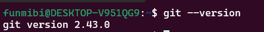
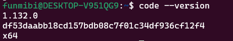
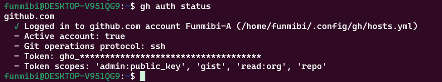
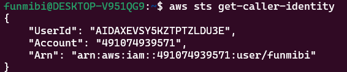
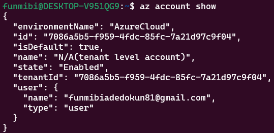
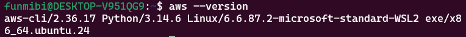
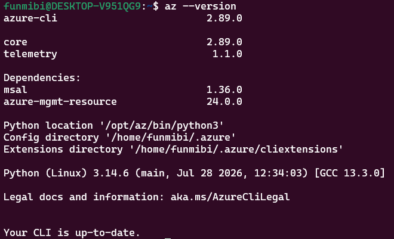

# DevOps Engineer Local Environment Setup

## Overview

This project focuses on the foundational requirement of any proficient DevOps engineer: the setup of a professional local development environment. By building a consistent and reproducible toolchain, learners will establish a "digital workshop" capable of handling containerization, orchestration, infrastructure as code, and AI-integrated workflows. The project emphasizes the transition from manual, inconsistent setups to automated, enterprise-grade environment provisioning to prevent "works on my machine" errors and ensure long-term productivity.

The workstation consists of:

- Windows 11 host operating system
- Ubuntu 24.04 LTS running through WSL2
- Windows Terminal
- Bash shell
- 24 GB RAM
- Intel Core i5-1135G7 processor
- Approximately 954 GB available storage

## Package Manager

The primary package manager used within the Ubuntu WSL2 environment was APT.

APT was used to update the system and install several required packages and dependencies.


```bash
sudo apt update
sudo apt upgrade -y
sudo apt install <package-name> -y
```

```text
DevOps Workstation Submission/
│
├── 01-Environment-Configuration/
│   |-- bashrc-config.txt
│
├── 02-Tooling-Verification/
│   |-- DevOps Workstation Setup.md
│
├── 03-Local-Cluster-Proof/
│   |-- minikube_status_1.png
|   |-- kubectl.png
│
└── 04-Setup-Logic/
    |-- README.md
```


## Evidence

### Local Tools

**Git**



**VSCode**




### Cloud Accounts
**GitHub**


**AWS**



**Azure**



### Cloud CLI Tools

**AWS CLI**



**Azure CLI**


